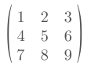

# Frinx coding challenges

Hello, you curious mind!  

We see you've found our coding challenges. Feel free to solve any (or all) of them. Then, create a pull request with your solutions. 
We will review it and if it passes our tests, we would be thrilled to invite you for a formal interview.

Who knows? Maybe you're the next member of our team.  

___

Here are the challenges for **Python**:  
(All of these should be solved without importing any libraries.)

1. Write a function that returns a list of indices of capital letters in a string. 
   For example, given string `"PYthOn"`, the function should return `[0,1,4]`.

2. Write a **recursive** function that checks whether a string is a palindrome. 
   A palindrome is a word that reads the same backward or forward. 
   Therefore, given input strings `"tenet"` or `"redder"`, your function should return `True`.
   Given strings `"frinx"` and `"python"`, it should return `False`.

3. Write a function that transposes a matrix. In python, you can represent this matrix  
       
    as a nested list:  
   `[[1,2,3],  [4,5,6],  [7,8,9]]`   
   After succesfully implementing the transposition, your function should return   
   `[[1,4,7], [2,5,8], [3,6,9]]`   
  *Extra points: Perform the tranposition in one line of code.*  
___
